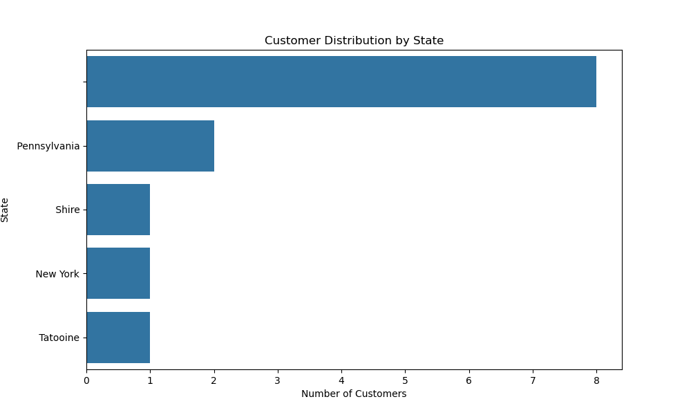
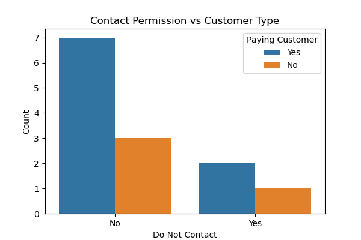
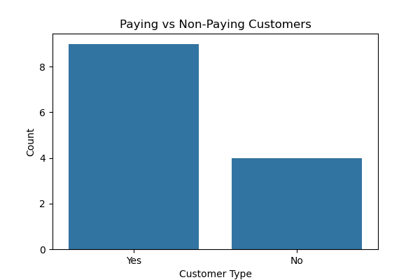

# 📊 Customer Data Cleaning & Visualization for Outreach Optimization

---

## 📌 Overview
This project focuses on transforming raw customer data into a **clean, structured, and business-ready dataset** for outreach operations.  

It ensures **data quality, compliance, and usability**, enabling call center and marketing teams to perform **targeted and efficient outreach**.

---

## 🎯 Objectives
- Clean and standardize messy customer data  
- Ensure compliance with **“Do Not Contact”** preferences  
- Identify **high-value (paying) customers**  
- Create a **call-ready dataset** for outreach  
- Generate visual insights for decision-making  

---

### 3️⃣ Data Visualization

#### 📍 Customer Distribution by State (Geographic Strategy)

- Identifies regions with higher customer concentration  
- Supports geographic targeting  

---

#### 📞 Contactability Analysis (Reachable vs Not Reachable)

- Shows reachable vs non-reachable customers  
- Ensures compliance and improves efficiency  

---

#### 💰 Paying vs Non-Paying Customers (Revenue Potential)

- Highlights high-value customers  
- Enables targeted outreach strategies  

---

## 🛠️ Tech Stack
- **Python**
- **Pandas**
- **Matplotlib / Seaborn**
- **Jupyter Notebook**

---

## 🔄 Workflow

### 1️⃣ Data Cleaning & Preprocessing
- Removed duplicates and handled missing values  
- Standardized phone numbers and text fields  
- Fixed inconsistent formatting  
- Converted raw data into structured format  

---

### 2️⃣ Business Logic Implementation
- Excluded **“Do Not Contact”** customers  
- Identified **paying customers**  
- Built a **call-ready dataset**  

---

## 📊 Key Insights
- Clean data improves **accuracy and usability**  
- Filtering ensures **compliance and better customer experience**  
- Segmentation enables **targeted decision-making**  

---

## 🚀 Outcome
- Delivered a **call-ready customer dataset**  
- Reduced manual effort for business teams  
- Enabled **data-driven outreach strategies**  

---

## 🤝 Connect
If you found this useful or have suggestions, feel free to connect!

---

## ⭐ Support
If you like this project, consider giving it a ⭐
